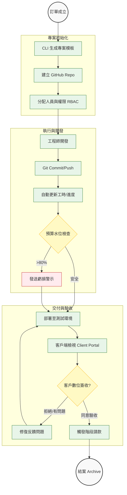

# 專案生命週期流程圖 (Project Life Cycle Flowchart)

> [!NOTE]
> 本流程圖描述專案從啟動、開發執行、階段驗收至結案的生命週期。

```mermaid
graph TD
    %% 節點定義
    Start((訂單成立))
    
    subgraph Initialization [專案初始化]
        InitTemplate[CLI 生成專案模板]
        Repo[建立 GitHub Repo]
        Role[分配人員與權限 RBAC]
    end
    
    subgraph Execution [執行與開發]
        Dev[工程師開發]
        Commit[Git Commit/Push]
        Worklog[自動更新工時/進度]
        BurnRate{預算水位檢查}
        Alert[發送虧損警示]
    end
    
    subgraph Delivery [交付與驗收]
        DeployTest[部署至測試環境]
        ClientReview[客戶端檢視 Client Portal]
        SignOff{客戶數位簽收?}
        Fix[修復反饋問題]
        Invoice[觸發階段請款]
    end
    
    End((結案 Archive))

    %% 樣式定義
    classDef default fill:#fff,stroke:#333,stroke-width:1px;
    classDef startend fill:#f9f9f9,stroke:#333,stroke-width:2px;
    classDef process fill:#e8f5e9,stroke:#2e7d32,stroke-width:1px;
    classDef decision fill:#fff9c4,stroke:#fbc02d,stroke-width:1px;
    classDef alert fill:#ffebee,stroke:#c62828,stroke-width:1px;

    class Start,End startend;
    class InitTemplate,Repo,Role,Dev,Commit,Worklog,DeployTest,ClientReview,Invoice,Fix process;
    class SignOff,BurnRate decision;
    class Alert alert;

    %% 流程連接
    Start --> InitTemplate
    InitTemplate --> Repo
    Repo --> Role
    Role --> Dev
    
    Dev --> Commit
    Commit --> Worklog
    Worklog --> BurnRate
    
    BurnRate -- >80% --> Alert
    BurnRate -- 安全 --> DeployTest
    Alert --> DeployTest
    
    DeployTest --> ClientReview
    ClientReview --> SignOff
    
    SignOff -- 拒絕/有問題 --> Fix
    Fix --> DeployTest
    
    SignOff -- 同意驗收 --> Invoice
    Invoice --> End
```

## 匯出說明
請使用以下指令匯出圖片：
`mmdc -i 專案生命週期流程圖.md -o 專案生命週期流程圖.png -b white -w 7680 -H 4320 -s 4`
