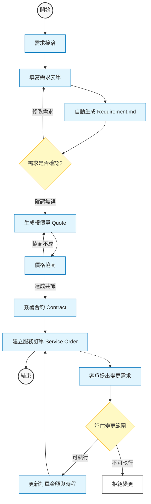

# 業務服務流程圖 (Service Workflow Flowchart)

> [!NOTE]
> 本流程圖描述從客戶接觸、需求確認、估價簽約到正式訂單建立的完整路徑。
> 請使用支持 Mermaid 的編輯器預覽。

```mermaid
graph TD
    %% 節點定義
    Start((開始))
    Contact[需求接洽]
    Form[填寫需求表單]
    AutoDoc[自動生成 Requirement.md]
    ConfirmReq{需求是否確認?}
    Quote[生成報價單 Quote]
    Negotiate[價格協商]
    SignContract[簽署合約 Contract]
    CreateOrder[建立服務訂單 Service Order]
    End((結束))

    %% 變更流程
    ChangeReq[客戶提出變更需求]
    ChangeReview{評估變更範圍}
    UpdateOrder[更新訂單金額與時程]
    RejectChange[拒絕變更]

    %% 樣式定義
    classDef default fill:#fff,stroke:#333,stroke-width:1px;
    classDef startend fill:#f9f9f9,stroke:#333,stroke-width:2px;
    classDef process fill:#e1f5fe,stroke:#0277bd,stroke-width:1px;
    classDef decision fill:#fff9c4,stroke:#fbc02d,stroke-width:1px;

    class Start,End startend;
    class Contact,Form,AutoDoc,Quote,Negotiate,SignContract,CreateOrder,UpdateOrder,ChangeReq process;
    class ConfirmReq,ChangeReview decision;
    
    %% 流程連接
    Start --> Contact
    Contact --> Form
    Form --> AutoDoc
    AutoDoc --> ConfirmReq
    
    ConfirmReq -- 修改需求 --> Form
    ConfirmReq -- 確認無誤 --> Quote
    
    Quote --> Negotiate
    Negotiate -- 協商不成 --> Quote
    Negotiate -- 達成共識 --> SignContract
    
    SignContract --> CreateOrder
    CreateOrder --> End
    
    %% 變更管理路徑
    CreateOrder -.-> ChangeReq
    ChangeReq --> ChangeReview
    ChangeReview -- 可執行 --> UpdateOrder
    ChangeReview -- 不可執行 --> RejectChange
    UpdateOrder --> CreateOrder
```

## 匯出說明
請使用以下指令匯出圖片：
`mmdc -i 業務流程圖.md -o 業務流程圖.png -b white -w 7680 -H 4320 -s 4`
