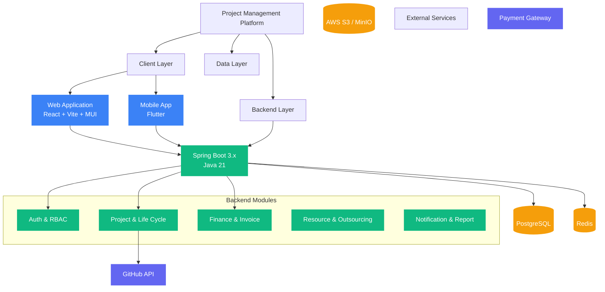

# 專案管理協作平台需求文檔

## 1. 專案概述 (Project Overview)
本專案旨在開發一套全方位、開發者導向的 **ERP 級專案管理系統**。系統將覆蓋從「業務接洽」到「軟體交付」的完整生命週期。不僅整合GitHub代碼同步，更包含自動化合約生成、專案模板建置 (Auto-Scaffold) 與會議智能摘錄功能。

### 1.1 核心目標 (Core Goals)
1.  **業務自動化 (Service Workflow)**: 標準化接案流程（需求 -> 估價 -> 合約 -> 訂單），並支援需求變更的動態追蹤。
2.  **開發自動化 (Dev Automation)**: 提供 CLI 工具，一鍵建立標準化專案架構。
3.  **可視化管理**: 透過 GitHub 整合，將 Commit/PR 數據轉化為工程師進度圖表。
4.  **智能輔助**: 整合語音轉文字 (STT) 技術，自動生成會議紀要。

## 2. 詳細技術架構 (Detailed Tech Stack) - 依據 Template 3 規範

本專案嚴格遵循 `docs/開發項目模板 3` 之核心規範 (`mainrule` & `projectrule`)。

### 2.1 後端 (Backend)
*   **語言**: **Java 21**
*   **框架**: **Spring Boot 3.x**
    *   *特點*: 企業級穩定性，強型別生態，適合大規模 ERP 邏輯。
*   **資料庫**: **PostgreSQL** (關聯式) + **Redis** (快取)。
*   **API**: 嚴格遵守 RESTful API 規範 (v1 版本控制)。

### 2.2 前端 (Web Frontend)
*   **語言**: **TypeScript**
*   **框架**: **React** + **Vite**
*   **UI 庫**: **Material-UI (MUI)**
    *   *特點*: Google 提出的成熟設計系統，組件豐富，適合後台管理介面。

### 2.3 行動端 (Mobile App)
*   **語言**: **Dart**
*   **框架**: **Flutter**
    *   *特點*: 高性能跨平台渲染，UI 一致性高。

### 2.4 自動化與工具
*   **CLI 工具**: 用於本地端自動下載模板、建立專案目錄。
*   **會議轉錄**: OpenAI Whisper 或 Google STT。

**系統架構圖 (System Architecture)**

## 3. 功能模組詳解 (Functional Modules)

### 3.1 業務服務流程 (Service Workflow)
*   **需求接洽與文檔自動化**: 填寫表單自動生成 `Requirement.md`。
*   **估價與簽約**: 自動計算報價區間，生成 PDF 合約與數位簽名。
*   **訂單管理**: 支援合約轉訂單、變更單 (Change Order) 管理。

### 3.2 專案管理與視覺化 (Project & Visualization)
*   **GitHub 深度整合**: 綁定 Repo 後，自動抓取 Commit Log、PR 狀態。
*   **工程師戰力圖**: 依據 Commit 量與 Code Review 活躍度生成圖表。
*   **進度甘特圖**: 實時比對計劃與實際進度。

### 3.3 開發自動化 (Dev Automation)
*   **Project Scaffolding**: 提供 CLI 一鍵建立符合規範的 Spring Boot / React 專案結構。
*   **會議記錄自動化**: 語音轉文字 (STT) 並歸納 Action Items。

### 3.4 核心 ERP 模組
*   **財務整合**: 代墊款管理、稅率自動換算 (5% 營業稅)、外包成本計算、預算水位警示 (80% Burn-rate)。
*   **資源管理**: 內部/外部人力負載分析 (Resource Capacity)。
*   **客戶入口 (Client Portal)**: 提供客戶檢視進度、驗收里程碑的專屬介面 (不含敏感成本資訊)。

## 4. 開發規範 (Development Standards - Strict)

依據 `rules.md`，本專案執行以下嚴格規範：

1.  **語言與溝通**: 全程使用**繁體中文**。
2.  **代碼雙語註釋**: 
    *   所有 Module/Service/Controller/Component 必須包含 **[繁體中文 - English]** 對照註釋。
    *   範例: `/** 獲取用戶 - Get User */`
3.  **Git 提交規範**:
    *   格式: `[Type]: [Subject - 中英混合]`
    *   範例: `feat: 增加登入功能 Add login feature`
4.  **Devlog 日誌系統**:
    *   每日必須維護 `devlog/YYYY-MM-DD-devlog.md`。
    *   格式嚴格要求：`## [標題] [HH:MM]`，包含 `### 完成功能` 與 `### 提交內容`。
    *   紀錄前必須執行 `date` 確認時間。

## 5. UI/UX 設計規範 (Design Guidelines)
*   **設計來源**: 採用 **`docs/CRM/`** 設計稿。
*   **視覺風格**: Clean CRM Blue (白底藍調)。
*   **元件庫**: 使用 Material-UI (MUI) 實現卡片式佈局與圓角設計。

## 6. 資料庫模型概觀 (Database Schema Concept)

-   **Users**: id, role=[ADMIN, PM, DEV, CLIENT], ...
-   **ServiceOrders**: id, contract_id, total_amount, status...
-   **Projects**: id, order_id, repo_url, ...
-   **FinancialRecords**: id, type, amount, status...
-   **MeetingNotes**: id, transcript, summary...