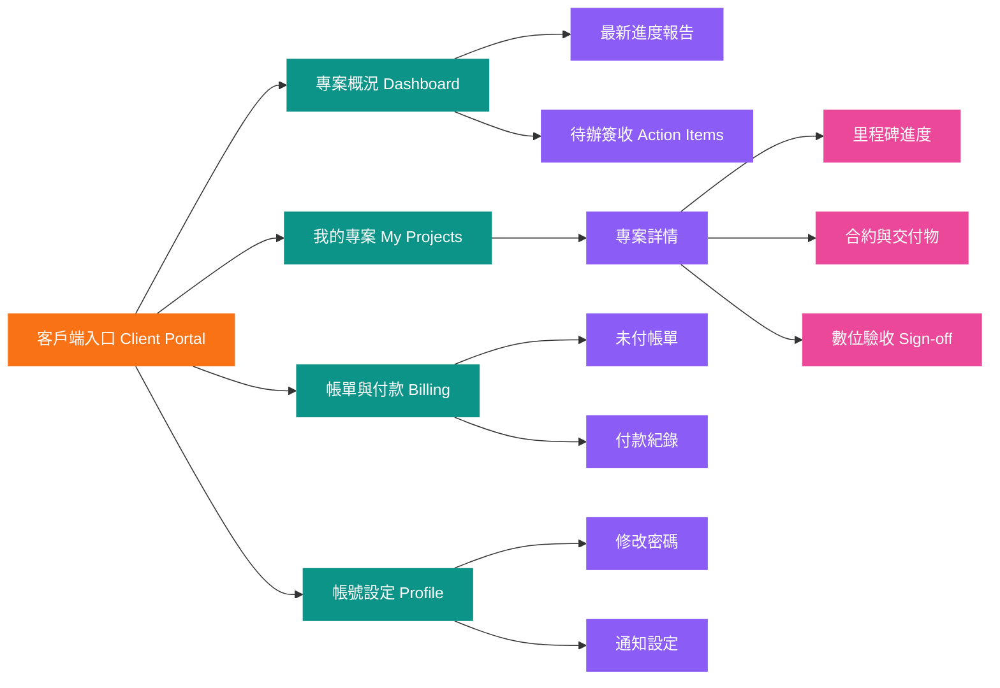

# 前台頁面結構 (Client Portal Structure)

> [!NOTE]
> 使用 Mermaid 繪製的客戶端檢視介面結構圖。
> 此介面需經過嚴格權限過濾，僅顯示允許客戶查看的資訊。

```mermaid
graph LR
    %% 樣式定義 (依據 Global Rules)
    classDef level1 fill:#f97316,stroke:none,color:white;
    classDef level2 fill:#0d9488,stroke:none,color:white;
    classDef level3 fill:#8b5cf6,stroke:none,color:white;
    classDef level4 fill:#ec4899,stroke:none,color:white;

    %% 結構樹
    Client[客戶端入口 Client Portal]:::level1
    
    %% 第一層：導航
    CDash[專案概況 Dashboard]:::level2
    CProj[我的專案 My Projects]:::level2
    CFin[帳單與付款 Billing]:::level2
    CSet[帳號設定 Profile]:::level2
    
    Client --> CDash
    Client --> CProj
    Client --> CFin
    Client --> CSet
    
    %% Dashboard
    CDash --> CStatus[最新進度報告]:::level3
    CDash --> CAction[待辦簽收 Action Items]:::level3
    
    %% My Projects
    CProj --> CPDetail[專案詳情]:::level3
    
    CPDetail --> CPD_Stage[里程碑進度]:::level4
    CPDetail --> CPD_File[合約與交付物]:::level4
    CPDetail --> CPD_Sign[數位驗收 Sign-off]:::level4
    
    %% Billing
    CFin --> CF_Inv[未付帳單]:::level3
    CFin --> CF_Hist[付款紀錄]:::level3
    
    %% Profile
    CSet --> CS_Pwd[修改密碼]:::level3
    CSet --> CS_Noti[通知設定]:::level3
```

## 匯出說明
請使用以下指令匯出圖片：
`mmdc -i 前台頁面結構.md -o 前台頁面結構.png -b white -w 7680 -H 4320 -s 4`
