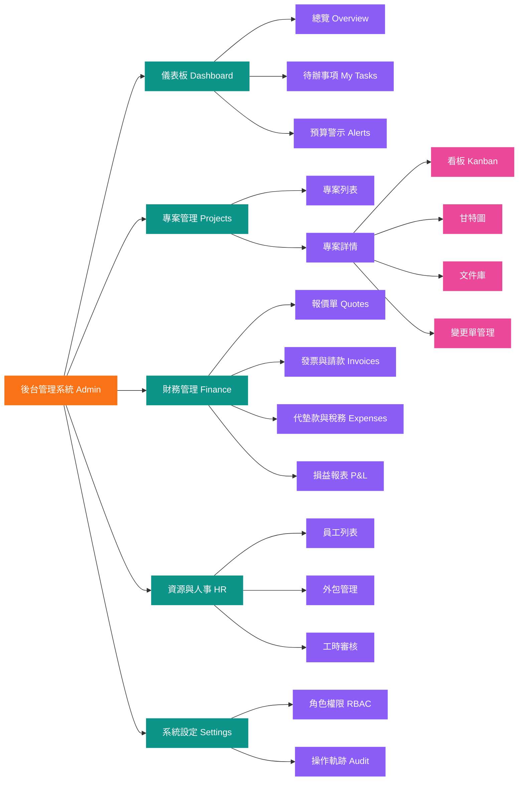

# 後台頁面結構 (Admin Portal Structure)

> [!NOTE]
> 使用 Mermaid 繪製的內部管理後台頁面結構圖。
> 顏色代表層級：L1(橘), L2(青), L3(紫), L4(粉)。

```mermaid
graph LR
    %% 樣式定義 (依據 Global Rules)
    classDef level1 fill:#f97316,stroke:none,color:white;
    classDef level2 fill:#0d9488,stroke:none,color:white;
    classDef level3 fill:#8b5cf6,stroke:none,color:white;
    classDef level4 fill:#ec4899,stroke:none,color:white;

    %% 結構樹
    Main[後台管理系統 Admin]:::level1
    
    %% 第一層：主導航
    Dash[儀表板 Dashboard]:::level2
    Proj[專案管理 Projects]:::level2
    Fin[財務管理 Finance]:::level2
    Res[資源與人事 HR]:::level2
    Set[系統設定 Settings]:::level2
    
    Main --> Dash
    Main --> Proj
    Main --> Fin
    Main --> Res
    Main --> Set
    
    %% Dashboard 子頁
    Dash --> DashOv[總覽 Overview]:::level3
    Dash --> DashTask[待辦事項 My Tasks]:::level3
    Dash --> DashAlert[預算警示 Alerts]:::level3
    
    %% Projects 子頁
    Proj --> ProjList[專案列表]:::level3
    Proj --> ProjDetail[專案詳情]:::level3
    
    ProjDetail --> PD_Board[看板 Kanban]:::level4
    ProjDetail --> PD_Gantt[甘特圖]:::level4
    ProjDetail --> PD_File[文件庫]:::level4
    ProjDetail --> PD_Change[變更單管理]:::level4
    
    %% Finance 子頁
    Fin --> FinQuote[報價單 Quotes]:::level3
    Fin --> FinInv[發票與請款 Invoices]:::level3
    Fin --> FinExp[代墊款與稅務 Expenses]:::level3
    Fin --> FinRep[損益報表 P&L]:::level3
    
    %% Resource 子頁
    Res --> ResEmp[員工列表]:::level3
    Res --> ResOut[外包管理]:::level3
    Res --> ResTime[工時審核]:::level3
    
    %% Settings 子頁
    Set --> SetRole[角色權限 RBAC]:::level3
    Set --> SetAudit[操作軌跡 Audit]:::level3
```

## 匯出說明
請使用以下指令匯出圖片：
`mmdc -i 後台頁面結構.md -o 後台頁面結構.png -b white -w 7680 -H 4320 -s 4`
